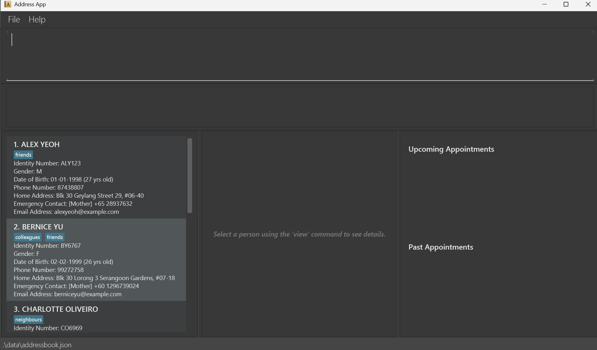

# HealthNote User Guide

Hello indie doctors, welcome to our **HealthNote User Guide**!

[//]: # (<!-- * Table of Contents -->)

[//]: # (<page-nav-print />)

### Table of Contents

<!-- TOC -->
* [HealthNote User Guide](#healthnote-user-guide)
    * [Table of Contents](#table-of-contents)
  * [Introduction](#introduction)
  * [Guide Usage](#guide-usage)
  * [User Interface](#user-interface)
  * [Quick Start](#quick-start)
  * [Features](#features)
    * [Command Format](#command-format)
    * [Input Constraints Table](#input-constraints-table)
  * [Features - General Features](#features-general-features)
    * [Viewing help : `help`](#viewing-help-help)
    * [Changing themes : `theme`](#changing-themes-theme)
    * [Exiting the program : `exit`](#exiting-the-program-exit)
  * [Features - Managing Patient Records](#features-managing-patient-records)
    * [Adding a patient: `add`](#adding-a-patient-add)
    * [Editing a patient : `edit`](#editing-a-patient-edit)
    * [Deleting a patient : `delete`](#deleting-a-patient-delete)
  * [Feature - Viewing Patient Records](#feature-viewing-patient-records)
    * [View a patient's medical information: `view`](#view-a-patients-medical-information-view)
    * [Listing all patients : `list`](#listing-all-patients-list)
    * [Locating patients by name: `find`](#locating-patients-by-name-find)
  * [Features - Managing Appointment Records](#features-managing-appointment-records)
    * [Scheduling an appointment: `schedule`](#scheduling-an-appointment-schedule-)
    * [Deleting upcoming appointment: `unschedule`](#deleting-upcoming-appointment-unschedule)
    * [Delete past appointment: `forget`](#delete-past-appointment-forget)
  * [Feature - Clearing Data](#feature-clearing-data)
    * [Clearing all entries : `clear`](#clearing-all-entries-clear)
  * [Feature - Data Management](#feature-data-management)
    * [Saving the data](#saving-the-data)
    * [Editing the data file](#editing-the-data-file)
    * [Archiving data files `[coming in v2.0]`](#archiving-data-files-coming-in-v20)
  * [FAQ](#faq)
  * [Glossary](#glossary)
  * [Known issues](#known-issues)
  * [Command Summary](#command-summary)
<!-- TOC -->

--------------------------------------------------------------------------------------------------------------------
## Introduction

Are you an independent doctor looking for a simple yet powerful way to manage patient information? Do you find existing clinic management systems too complex or cumbersome for your daily needs? Or perhaps you just want a lightweight, privacy-focused tool that keeps your patients’ records right at your fingertips?

**HealthNote** is your all-in-one, command-line solution for seamless patient management - designed specifically for doctors who value speed, control, and simplicity.

With **HealthNote**, you can easily:
- **Add** new patients and record key details such as contact information, medical history, and allergies
- **View** a patient’s medical information in seconds
- **Find** patients by name or specific keywords
- **Delete** outdated records when necessary
- …and do much more - all directly from your terminal!

Built with independent practitioners and small clinics in mind, **HealthNote** keeps your workflow efficient and focused. Whether you’re managing a handful of patients or maintaining a growing list, this CLI-based address book gives you the precision and speed you need - without unnecessary clutter.

HealthNote is a desktop app for managing contacts, optimized for use via a Line Interface (CLI) while still having the benefits of a Graphical User Interface (GUI). If you can type fast, HealthNote can get your patient management tasks done faster than traditional GUI apps.

--------------------------------------------------------------------------------------------------------------------
## Guide Usage

**For Novices**

* For first time users unfamiliar of CLI, perhaps you can first jump to the [Quick Start](#quick-start) section to get started

**For Amateurs**

* Perhaps you can jump to the [Table of Contents](#table-of-contents) to start navigating the guide.

**For Experts**

* Perhaps you can jump to the [Command summary](#command-summary) for a quick summary of the commands.

--------------------------------------------------------------------------------------------------------------------

## User Interface

Here are the key components of the HealthNote User Interface (UI), designed for the convenience of our users.

*insert the UI photo here this is just a placeholder for now with labels for the components*

| No | Component        | Description                                                                            |
|----|------------------|----------------------------------------------------------------------------------------|
| 1  | Command Input    | This is where the user inputs commands to perform various tasks.                       |
| 2  | Command Result   | Displays the output and the result of performing a command.                            |
| 3  | Patient List     | Displays the list of patients.                                                         |
| 4  | View Patient     | Displays all the data fields of patients which the user requests to view.              |
| 5  | Appointment List | Displays the upcoming and past appointments, including past and upcoming appointments. |

--------------------------------------------------------------------------------------------------------------------

## Quick Start

1. Ensure you have Java `17` or above installed in your Computer. 
   **Mac users:** Ensure you have the precise JDK version prescribed [here](https://se-education.org/guides/tutorials/javaInstallationMac.html).

2. Download the latest `.jar` file from [here](https://github.com/se-edu/addressbook-level3/releases).

3. Copy the file to the folder you want to use as the _home folder_ for your HealthNote.

4. Open a command terminal, `cd` into the folder you put the jar file in, and use the `java -jar addressbook.jar` command to run the application. 
   A GUI similar to the below should appear in a few seconds. Note how the app contains some sample data. 
   

5. Type the command in the command box and press Enter to execute it. e.g. typing **`help`** and pressing Enter will open the help window. 
   Some example commands you can try:

   * `list` : Lists all contacts.

   * `add n/John Doe p/98765432 e/johnd@example.com a/John street, block 123, #01-01` : Adds a contact named `John Doe` to the Address Book.

   * `delete 3` : Deletes the 3rd contact shown in the current list.

   * `clear` : Deletes all contacts.

   * `exit` : Exits the app.

6. Refer to the [Features](#features) below for details of each command.

--------------------------------------------------------------------------------------------------------------------

## Features

### Command Format
<box type="info" seamless>

**Notes about the command format:** 

* Words in `UPPER_CASE` are the parameters to be supplied by the user. 
  e.g. in `add n\NAME`, `NAME` is a parameter which can be used as `add n\John Doe`.

* Items in square brackets are optional. 
  e.g `n\NAME [t\TAG]` can be used as `n\John Doe t\friend` or as `n\John Doe`.

* Items with `…`​ after them can be used multiple times including zero times. 
  e.g. `[t\TAG]…​` can be used as ` ` (i.e. 0 times), `t\friend`, `t\friend t\family` etc.

* Parameters can be in any order. 
  e.g. if the command specifies `n\NAME p\PHONE_NUMBER`, `p\PHONE_NUMBER n\NAME` is also acceptable.

* Extraneous parameters for commands that do not take in parameters (such as `help`, `list`, `exit` and `clear`) will be ignored. 
  e.g. if the command specifies `help 123`, it will be interpreted as `help`.

* If you are using a PDF version of this document, be careful when copying and pasting commands that span multiple lines as space characters surrounding line-breaks may be omitted when copied over to the application.
</box>

### Input Constraints Table

**Caution:**

* The symbol is `\` is reserved as a command delimiter. While it is not explicitly prohibited in command values, it is
  highly discouraged as it could cause unexpected behaviour.

| **Field (with Prefix)**        | **Valid Input(s)**                                      | **Invalid Input(s)**           | **Requirement(s)**                                                                                            |
|--------------------------------|---------------------------------------------------------|--------------------------------|---------------------------------------------------------------------------------------------------------------|
| **n\\NAME**                    | Alex the 3rd, John Doe, Damith s/o Sankar Ashish        | (Empty)                        | Names can take any values, and it should not be blank                                                         |
| **id\\IDENTITY_NUMBER**        | S1234567A, T7654321B, 060402-06-6767                    | %&!, 12 3-4                    | Identity number should only contain alphanumeric characters and/or "-", without spaces                        |
| **p\\CONTACT_NUMBER**          | 9888-3333 (Office)                                      | abcdefg, 3 3 3                 | Must contain at least 2 consecutive digits                                                                    |
| **e\\EMAIL**                   | e01234567@u.nus.edu, jinHeng@gmail.com                  | joe@, asd@@@asd                | Emails should be of the format local-part@domain                                                              |
| **addr\\HOME_ADDRESS**         | 123 Main St                                             | (Empty)                        | Addresses can take any values, and it should not be blank                                                     |
| **ec\\EMERGENCY_CONTACT**      | [Mother] 9888-3333 (Office), [Brother] 9777-3333 (Home) | 9888-3333, 2222aaaa            | Must be in the form [{relationship}] {phone} where phone contains at least 2 consecutive digits               |
| **dob\\DATE_OF_BIRTH**         | 05-23-1967, 12/10/1987                                  | 99-05-23, 19871312, 2020-12-20 | Date of birth should be of the following formats: D-M-YYYY, D/M/YYYY, or M-D-YYYY                             |
| **b\\BLOOD_TYPE**              | A+, O-, AB, Bombay (hh), A Rh(D) negative               | (Empty)                        | Blood types can take any values, and it should not be blank                                                   |
| **g\\GENDER**                  | Male, Female, Non-binary, Helicopter                    | (Empty)                        | Genders can take any values, and it should not be blank                                                       |
| **ar\\ALCOHOLIC_RECORD**       | None, Occasionally, Heavy                               | (Empty)                        | Alcoholic Record can take any values, and it should not be blank                                              |
| **sr\\SMOKING_RECORD**         | None, Occasionally, Quitter, Heavy                      | (Empty)                        | Smoking Record can take any values, and it should not be blank                                                |
| **pmh\\PAST_MEDICAL_HISTORY**  | None, Diabetes, Hypertension                            | (Empty)                        | Past Medical History can take any values, and it should not be blank                                          |
| **t\\TAG**                     | Urgent, HighRisk, VIP                                   | (Empty)                        | Tags names can take any values, and it should not be blank                                                    |
| **al\\ALLERGY**                | Peanuts, Penicillin                                     | (Empty)                        | Allergy names can take any values, and it should not be blank                                                 |
| **m\\MEDICINE**                | 500mg Ibuprofen, 2 Panadol capsules/day                 | (Empty)                        | Medicine field can take any values, and it should not be blank                                                |
| **adt\\APPOINTMENT_DATE_TIME** | 13-10-2025 10:00                                        | 22233344                       | Appointment date & time should be of the following formats: D-M-YYYY HH:MM, D/M/YYYY HH:MM, or M-D-YYYY HH:MM |
| **note\\APPOINTMENT_NOTE**     | Needs IV Drip                                                        | (Empty)                        | Appointment notes can take any values, and it should not be blank                                                                                            |

[Back to Table of Contents](#table-of-contents)

--------------------------------------------------------------------------------------------------------------------

## Features - General Features

### Viewing help : `help`

Displays the help window or brings the help window to the front if it is already opened.

Format: `help`

### Changing themes : `theme`

Changes the theme of the app.

Format: `theme COLOUR`

There are 4 themes: `light`, `dark`, `blue`, `pink`

Example: `theme light`

### Exiting the program : `exit`

Exits the program.

Format: `exit`

[Back to Table of Contents](#table-of-contents)

--------------------------------------------------------------------------------------------------------------------

## Features - Managing Patient Records

### Adding a patient: `add`

Adds a patient to the address book.

Format: `add n\NAME id\IDENTITY_NUMBER p\PHONE e\EMAIL addr\ADDRESS ec\EMERGENCY CONTACT dob\DATE OF BIRTH b\BLOOD TYPE 
[ar\ALCOHOLIC RECORD] g\GENDER [sr\SMOKING RECORD] [pmh\PAST MEDICAL HISTORY] [t\TAG][al\ALLERGY][m\MEDICINE]...…​`

| **Field (with Prefix)**      | **Compulsory?** | **Can have multiple?** | **Description**                                                                     |
|------------------------------|-----------------|------------------------|-------------------------------------------------------------------------------------|
| **n\NAME**                   | Yes             | No                     | Full legal name of the patient.                                                     |
| **id\IDENTITY_NUMBER**       | Yes             | No                     | Unique identification number (e.g., national ID, passport number, or hospital ID).  |
| **p\CONTACT_NUMBER**         | Yes             | No                     | Primary phone number for reaching the patient.                                      |
| **e\EMAIL**                  | Yes             | No                     | Patient’s active email address for communication.                                   |
| **addr\HOME_ADDRESS**        | Yes             | No                     | Current residential address of the patient.                                         |
| **ec\EMERGENCY_CONTACT**     | Yes             | No                     | Name and contact details of a person to call in case of emergency.                  |
| **dob\DATE_OF_BIRTH**        | Yes             | No                     | Patient’s date of birth.                                                            |
| **b\BLOOD_TYPE**             | Yes             | No                     | Patient’s blood group (e.g., A+, O-, etc.).                                         |
| **g\GENDER**                 | Yes             | No                     | Gender identity of the patient (e.g., Male, Female, Non-binary, Prefer not to say). |
| **ar\ALCOHOLIC_RECORD**      | No              | No                     | Indicates whether the patient consumes alcohol and relevant details or frequency.   |
| **sr\SMOKING_RECORD**        | No              | No                     | Indicates whether the patient smokes and relevant details or frequency.             |
| **pmh\PAST_MEDICAL_HISTORY** | No              | No                     | Summary of major past illnesses, surgeries, or chronic conditions.                         |
| **t\TAG**                    | No              | Yes                    | Custom labels or categories for organising patients.                                |
| **al\ALLERGY**               | No              | Yes                    | List of known allergies (e.g., “Peanuts”, “Penicillin”).                            |
| **m\MEDICINE**               | No              | Yes                    | List of current medications prescribed to the patient.                              |

**ℹ️ Info:** 
* When adding patients without using the optional fields `Alcoholic Record`, `Smoking Record` and `Past Medical Diagnoses`, they will have default values "None" for these fields . 
* You can enter any number of tags, allergies, medicines (including 0).

<box type="tip" seamless>

**Tip:** The fields can be entered in any order.
</box>

Examples:
* `add n\John Doe id\A91234567 p\98765432 e\johnd@example.com addr\311, Clementi Ave 2, #02-25 ec\[Mother] +6591234567
 b\AB ar\Social drinker g\M dob\01-01-2000 sr\Heavy smoker al\nuts t\priorityHigh t\diabetesFollowUp pmh\Diabetes
 m\100mg painkillers/day m\100mg Panadol/day`

* `add n\John Doe id\A91234567 p\98765432 e\johnd@example.com addr\311, Clementi Ave 2, #02-25 ec\[Mother] +6591234567
  b\AB ar\Social drinker g\M dob\01-01-2000`

**Here is a list of common errors and how to prevent them**

| Error Message                                 | Reason                                                          | Solution                                                             |
|-----------------------------------------------|-----------------------------------------------------------------|----------------------------------------------------------------------|
| The person already exists in the address book | You are adding a patient with the same id as an existing patient | Ensure that you do not enter a patient with the same id as an existing patient. |
| Invalid command format!                       | Some of the essential prefixes could be missing or misspelled   | Refer to the [command format](#adding-a-patient-add)                 |
| Unknown command                               | The `add` command may be misspelled or not entirely in lowercase | Ensure that you use `add` exactly in lowercase.                      |
| Errors relating to invalid field inputs       | You have entered invalid inputs for a field.                    | Ensure that your inputs meet the constraints stated in the [Input Constraints Table](#input-constraints-table)          |

[Back to Table of Contents](#table-of-contents)

### Editing a patient : `edit`

Edits an existing patient in the address book.

Format: `edit INDEX [n\NAME] [id\IDENTITY_NUMBER] [p\PHONE] [e\EMAIL] [addr\ADDRESS]
 [ec\EMERGENCY_CONTACT] [dob\DATE OF BIRTH] [b\BLOOD TYPE] [ar\ALCOHOLIC RECORD] [g\GENDER] [sr\SMOKING RECORD] 
 [pmh\PAST MEDICAL HISTORY] [t\TAG] [al\ALLERGY] [m\MEDICINE]...…​`

* Edits the patient at the specified `INDEX`. The index refers to the index number shown in the displayed patient list. The index **must be a positive integer** 1, 2, 3, …​
* At least one of the optional fields must be provided.
* Existing values will be updated to the input values.

**ℹ️ Info:** 
* When editing tags, the existing tags of the patient will be removed i.e adding of tags is not cumulative. This applies to medicines and allergies as well
* You can remove all the patient’s tags by typing `t\` without
  specifying any tags after it.
* You can remove all the patient’s medicine record by typing `m\` without
  specifying any tags after it.
* You can remove all the patient’s allergies by typing `al\` without
  specifying any tags after it.

| **Field (with Prefix)**                  | **Compulsory?** | **Can have multiple?** | **Description**                                                                     |
|------------------------------------------|-----------------|------------------------|-------------------------------------------------------------------------------------|
| **INDEX**                                | Yes             | No                     | Index of the patient in the Patient List Panel.                                     |
| **n\NAME**                              | No              | No                     | Full legal name of the patient.                                                     |
| **id\IDENTITY_NUMBER**                  | No              | No                     | Identification number (e.g., national ID, passport number, or hospital ID).         |
| **p\CONTACT_NUMBER**                    | No              | No                     | Primary phone number for reaching the patient.                                      |
| **e\EMAIL**                             | No              | No                     | Patient’s email address for communication.                                          |
| **addr\HOME_ADDRESS**                   | No              | No                     | Current residential address of the patient.                                         |
| **ec\EMERGENCY_CONTACT**                | No              | No                     | Name and contact details of a person to contact in case of emergency.               |
| **dob\DATE_OF_BIRTH**                   | No              | No                     | Patient’s date of birth.                                                            |
| **b\BLOOD_TYPE**                        | No              | No                     | Patient’s blood group (e.g., A+, O-, etc.).                                         |
| **g\GENDER**                            | No              | No                     | Gender identity of the patient (e.g., Male, Female, Non-binary, Prefer not to say). |
| **ar\ALCOHOLIC_RECORD**                 | No              | No                     | Indicates whether the patient consumes alcohol and relevant details or frequency.   |
| **sr\SMOKING_RECORD (optional)**        | No              | No                     | Indicates whether the patient smokes and relevant details or frequency.             |
| **pmh\PAST_MEDICAL_HISTORY (optional)** | No              | No                     | Summary of major past illnesses, surgeries, or chronic conditions.                  |
| **t\TAG (optional, multiple)**          | No              | Yes                    | Custom labels or categories for organising patients.                                |
| **al\ALLERGY (optional, multiple)**     | No              | Yes                    | List of known allergies (e.g., “Peanuts”, “Penicillin”).                            |
| **m\MEDICINE (optional, multiple)**     | No              | Yes                    | List of current medications prescribed to the patient.                              |

Examples:
*  `edit 1 p\91234567 e\johndoe@example.com` Edits the phone number and email address of the 1st patient to be `91234567` and `johndoe@example.com` respectively.
*  `edit 2 n\Betsy Crower t\` Edits the name of the 2nd patient to be `Betsy Crower` and clears all existing tags.

**Here is a list of common errors and how to prevent them**

| Error Message                                 | Reason                                                                                    | Solution                                                                                                      |
|-----------------------------------------------|-------------------------------------------------------------------------------------------|---------------------------------------------------------------------------------------------------------------|
| The person already exists in the address book | You are editing a patient to have the same id as an existing patient                      | Ensure that you do not enter a patient with the same id as an existing patient.                               |
| Invalid command format!                       | Some of the prefixes could be missing or misspelled, or you entered a non-positive index. | Refer to the [command format](#editing-a-patient-edit)                                                        |
| Unknown command                               | The `edit` command may be misspelled or not entirely in lowercase                         | Ensure that you use `edit` exactly in lowercase.                                                              |
| Errors relating to invalid field inputs       | You have entered invalid inputs for a field.                                              | Ensure that your inputs meet the constraints stated in the [Input Constraints Table](#input-constraints-table) |
| The person index provided is invalid          | You have entered an invalid index                                                         | Ensure that the index not more than the number of patients in HealthNote.                                     |
| At least one field to edit must be provided.  | You have not entered any fields to edit.                                                  | Enter at least one field to edit.                                                                             |

[Back to Table of Contents](#table-of-contents)

### Deleting a patient : `delete`

Deletes the specified patient from the address book.

Format: `delete INDEX`

* Deletes the patient at the specified `INDEX`.
* The index refers to the index number shown in the displayed patient list.
* The index **must be a positive integer** 1, 2, 3, …​

Examples:
* `list` followed by `delete 2` deletes the 2nd patient in the address book.
* `find Betsy` followed by `delete 1` deletes the 1st patient in the results of the `find` command.

**Here is a list of common errors and how to prevent them**

| Error Message                                 | Reason                                                              | Solution                                                                  |
|-----------------------------------------------|---------------------------------------------------------------------|---------------------------------------------------------------------------|
| Invalid command format!                       | You might not have entered a positive INDEX.                        | Enter a positive INDEX.                                                   |
| Unknown command                               | The `delete` command may be misspelled or not entirely in lowercase | Ensure that you use `delete` exactly in lowercase.                        |
|      The person index provided is invalid                                         | You have entered an invalid index                                   | Ensure that the index not more than the number of patients in HealthNote. |

[Back to Table of Contents](#table-of-contents)

--------------------------------------------------------------------------------------------------------------------

## Feature - Viewing Patient Records

### View a patient's medical information: `view`

Displays the medical information of the patient at the specified INDEX

Format: `view INDEX`

Example: `view 1`

### Listing all patients : `list`

Shows a list of all patients in the address book.

Format: `list`

### Locating patients by name: `find`

Finds patients whose names contain any of the given keywords.

Format: `find KEYWORD [MORE_KEYWORDS]`

* The search is case-insensitive. e.g `hans` will match `Hans`
* The order of the keywords does not matter. e.g. `Hans Bo` will match `Bo Hans`
* Only the name is searched.
* Only full words will be matched e.g. `Han` will not match `Hans`
* Persons matching at least one keyword will be returned (i.e. `OR` search).
  e.g. `Hans Bo` will return `Hans Gruber`, `Bo Yang`

Examples:
* `find John` returns `john` and `John Doe`
* `find alex david` returns `Alex Yeoh`, `David Li` 
  

[Back to Table of Contents](#table-of-contents)

--------------------------------------------------------------------------------------------------------------------

## Features - Managing Appointment Records

### Scheduling an appointment: `schedule` 

Adds the appointment for the patient identified by the index number used in the displayed patient list.

Format: `schedule INDEX adt\APPOINTMENT_TIME [note\APPOINTMENT_NOTE]`

* Adds an appointment the patient at the specified `INDEX`.
* The index refers to the index number shown in the displayed **patient** list.
* The index **must be a positive integer** 1, 2, 3, …​
* Note that APPOINTMENT_NOTE is optional

Example:
* `schedule 1 adt\13-10-2025 10:00 note\Needs IV Drip`

### Deleting upcoming appointment: `unschedule`

Deletes the upcoming appointment identified by the index number used in the displayed upcoming appointment list.

Format: `unschedule INDEX`

* Deletes the upcoming appointment at the specified `INDEX`.
* The index refers to the index number shown in the displayed **Upcoming Appointments** list.
* The index **must be a positive integer** 1, 2, 3, …​

Example:
* `unschedule 1`

### Delete past appointment: `forget`

Deletes the past appointment identified by the index number used in the displayed past appointment list.

Format: `forget INDEX`

* Deletes the past appointment at the specified `INDEX`.
* The index refers to the index number shown in the displayed **Past Appointments** list.
* The index **must be a positive integer** 1, 2, 3, …​

Example:
* `forget 1`

[Back to Table of Contents](#table-of-contents)

--------------------------------------------------------------------------------------------------------------------

## Feature - Clearing Data

### Changing the colour theme : `theme`

Changes the colour theme of the application.

Format: `theme THEME_NAME`
* Available themes: `light`, `dark`, `blue`, `pink`

### Clearing all entries : `clear`

Clears all entries from the app.

Format: `clear CONFIRM`

**❗Warning:** 
* This action cannot be undone. You must type exactly 'clear CONFIRM' (case-sensitive) to execute

[Back to Table of Contents](#table-of-contents)

--------------------------------------------------------------------------------------------------------------------

## Feature - Data Management

### Saving the data

HealthNote data are saved in the hard disk automatically after any command that changes the data. There is no need to save manually.

### Editing the data file

HealthNote data are saved automatically as a JSON file `[JAR file location]/data/addressbook.json`. Advanced users are welcome to update data directly by editing that data file.

<box type="warning" seamless>

**Caution:**
If your changes to the data file makes its format invalid, HealthNote will discard all data and start with an empty data file at the next run.  Hence, it is recommended to take a backup of the file before editing it. 
Furthermore, certain edits can cause the HealthNote to behave in unexpected ways (e.g., if a value entered is outside the acceptable range). Therefore, edit the data file only if you are confident that you can update it correctly.
</box>

### Archiving data files `[coming in v2.0]`

_Details coming soon ..._

[Back to Table of Contents](#table-of-contents)

--------------------------------------------------------------------------------------------------------------------

## FAQ

**Q**: How do I transfer my data to another Computer? 
**A**: Install the app in the other computer and overwrite the empty data file it creates with the file that contains the data of your previous HealthNote home folder.

[Back to Table of Contents](#table-of-contents)

--------------------------------------------------------------------------------------------------------------------

## Glossary

| **Term**                     | **Explanation**                            |
|------------------------------|--------------------------------------------|
| Alphanumeric                 | Consists of numbers and/or alphabets only. |
| CLI (Command-Line Interface) |        A text-based interface where you type commands to interact with the app.                                    |
| Command                      |  An instruction entered by the user (e.g., `add`, `edit`, `delete`).                                          |
| Field                        |   A specific piece of information in a patient’s record (e.g., name, address, blood type).                                         |
| Prefix                       |   A short label before a field to identify it in a command (e.g., `n\` for name, `p\` for phone).                                         |
| Index                        |   The number showing a patient’s position in the displayed list. Used in commands like `edit` or `delete`.                                                                                                                                        |
|        Integer                      |     A whole number (no decimals). In HealthNote, indexes must be positive integers such as 1, 2, 3, etc.                                                                                                                                                                                                                                              |
|               GUI (Graphical User Interface)                      |         The visual interface showing panels, buttons, and text boxes.                                                                                                                                                                                                                                                                                                                                              |

[Back to Table of Contents](#table-of-contents)

--------------------------------------------------------------------------------------------------------------------

## Known issues

1. **When using multiple screens**, if you move the application to a secondary screen, and later switch to using only the primary screen, the GUI will open off-screen. The remedy is to delete the `preferences.json` file created by the application before running the application again.
2. **If you minimize the Help Window** and then run the `help` command (or use the `Help` menu, or the keyboard shortcut `F1`) again, the original Help Window will be focused, and no new Help Window will appear. The remedy is to manually restore the minimized Help Window.

[Back to Table of Contents](#table-of-contents)

--------------------------------------------------------------------------------------------------------------------

## Command Summary

Summary of all the commands.

<box type="info" seamless>

**Info:** 
* Fields with square brackets `[prefix\field]` indicates it is an optional field.
* Commands without any arguments will still execute if user inputs additional arguments
* You may view [Command Format](#command-format) for more details.

</box>

| Action                        | Format, Examples                                                                                                                                                                                                                                                                                                                                                                                                                                                                                                              |
|-------------------------------|-------------------------------------------------------------------------------------------------------------------------------------------------------------------------------------------------------------------------------------------------------------------------------------------------------------------------------------------------------------------------------------------------------------------------------------------------------------------------------------------------------------------------------|
| **Add**                       | `n\NAME id\IDENTITY_NUMBER p\PHONE e\EMAIL addr\ADDRESS ec\EMERGENCY CONTACT dob\DATE OF BIRTH b\BLOOD TYPE [ar\ALCOHOLIC RECORD] g\GENDER [sr\SMOKING RECORD] [pmh\PAST MEDICAL HISTORY] [t\TAG][al\ALLERGY][m\MEDICINE]...…​`   e.g., `add n\John Doe id\A91234567 p\98765432 e\johnd@example.com addr\311, Clementi Ave 2, #02-25 ec\[Mother] +6591234567 b\AB ar\Social drinker g\M dob\01-01-2000 sr\Heavy smoker al\nuts t\priorityHigh t\diabetesFollowUp pmh\Diabetes m\100mg painkillers/day m\100mg Panadol/day` |
| **Clear**                     | `clear CONFIRM`                                                                                                                                                                                                                                                                                                                                                                                                                                                                                                               |
| **Delete**                    | `delete INDEX`  e.g., `delete 3`                                                                                                                                                                                                                                                                                                                                                                                                                                                                                           |
| **Edit**                      | `INDEX [n\NAME] [id\IDENTITY_NUMBER] [p\PHONE] [e\EMAIL] [addr\ADDRESS] [ec\EMERGENCY_CONTACT] [dob\DATE OF BIRTH] [b\BLOOD TYPE] [ar\ALCOHOLIC RECORD] [g\GENDER] [sr\SMOKING RECORD] [pmh\PAST MEDICAL HISTORY] [t\TAG] [al\ALLERGY] [m\MEDICINE]...…​`  e.g.,`edit 2 n\James Lee e\jameslee@example.com`                                                                                                                                                                                                                |
| **Find**                      | `find KEYWORD [MORE_KEYWORDS]`  e.g., `find James Jake`                                                                                                                                                                                                                                                                                                                                                                                                                                                                    |
| **List**                      | `list`                                                                                                                                                                                                                                                                                                                                                                                                                                                                                                                        |
| **View**                      | `view INDEX`  e.g., `view 1`                                                                                                                                                                                                                                                                                                                                                                                                                                                                                               |
| **Help**                      | `help`                                                                                                                                                                                                                                                                                                                                                                                                                                                                                                                        |
| **Schedule an Appointment**   | `schedule INDEX adt\APPOINTMENT_DATE_TIME [note\NOTE]`                                                                                                                                                                                                                                                                                                                                                                                                                                                                        |
| **Unschedule an appointment** | `unschedule INDEX`                                                                                                                                                                                                                                                                                                                                                                                                                                                                                                            |
| **Remove a Past Appointment** | `forget INDEX`                                                                                                                                                                                                                                                                                                                                                                                                                                                                                                                |

[Back to Table of Contents](#table-of-contents)
