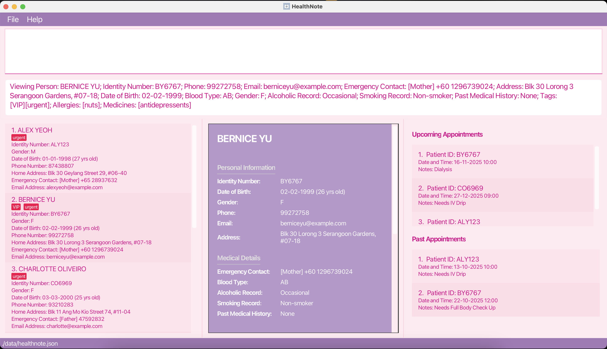
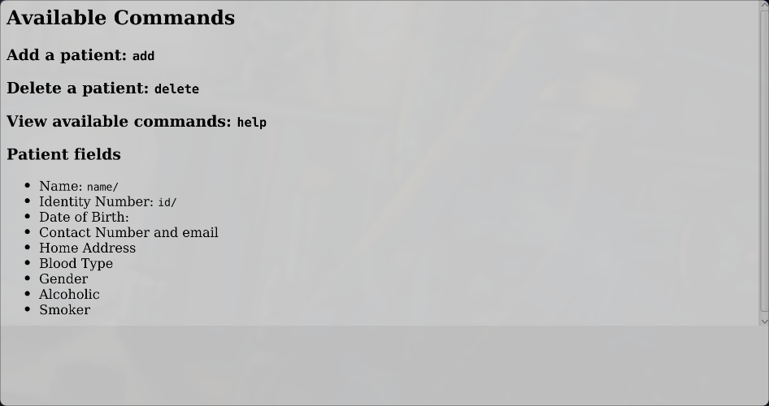

# HealthNote User Guide

Hello, shout out to all my indie doctors out there, this app is for you.

[//]: # (<!-- * Table of Contents -->)

[//]: # (<page-nav-print />)

### Table of Contents

* Table of Contents

{:toc}

--------------------------------------------------------------------------------------------------------------------
## Introduction

Are you an independent doctor looking for a simple yet powerful way to manage patient information? Do you find existing clinic management systems too complex or cumbersome for your daily needs? Or perhaps you just want a lightweight, privacy-focused tool that keeps your patients’ records right at your fingertips?

**HealthNote** is your all-in-one, command-line solution for seamless patient management — designed specifically for doctors who value speed, control, and simplicity.

With **HealthNote**, you can easily:
- **Add** new patients and record key details such as contact information, medical history, and allergies
- **View** a patient’s medical information in seconds
- **Find** patients by name or specific keywords
- **Delete** outdated records when necessary
- …and do much more — all directly from your terminal!

Built with independent practitioners and small clinics in mind, **HealthNote** keeps your workflow efficient and focused. Whether you’re managing a handful of patients or maintaining a growing list, this CLI-based address book gives you the precision and speed you need — without unnecessary clutter.

--------------------------------------------------------------------------------------------------------------------

## Quick start

1. Ensure you have Java `17` or above installed in your Computer. 
   **Mac users:** Ensure you have the precise JDK version prescribed [here](https://se-education.org/guides/tutorials/javaInstallationMac.html).

2. Download the latest `.jar` file from [here](https://github.com/se-edu/addressbook-level3/releases).

3. Copy the file to the folder you want to use as the _home folder_ for your HealthNote.

4. Open a command terminal, `cd` into the folder you put the jar file in, and use the `java -jar addressbook.jar` command to run the application. 
   A GUI similar to the below should appear in a few seconds. Note how the app contains some sample data. 
   

5. Type the command in the command box and press Enter to execute it. e.g. typing **`help`** and pressing Enter will open the help window. 
   Some example commands you can try:

   * `list` : Lists all contacts.

   * `add n/John Doe p/98765432 e/johnd@example.com a/John street, block 123, #01-01` : Adds a contact named `John Doe` to the Address Book.

   * `delete 3` : Deletes the 3rd contact shown in the current list.

   * `clear` : Deletes all contacts.

   * `exit` : Exits the app.

6. Refer to the [Features](#features) below for details of each command.

--------------------------------------------------------------------------------------------------------------------

## Features

<box type="info" seamless>

**Notes about the command format:** 

* Words in `UPPER_CASE` are the parameters to be supplied by the user. 
  e.g. in `add n\NAME`, `NAME` is a parameter which can be used as `add n\John Doe`.

* Items in square brackets are optional. 
  e.g `n\NAME [t\TAG]` can be used as `n\John Doe t\friend` or as `n\John Doe`.

* Items with `…`​ after them can be used multiple times including zero times. 
  e.g. `[t\TAG]…​` can be used as ` ` (i.e. 0 times), `t\friend`, `t\friend t\family` etc.

* Parameters can be in any order. 
  e.g. if the command specifies `n\NAME p\PHONE_NUMBER`, `p\PHONE_NUMBER n\NAME` is also acceptable.

* Extraneous parameters for commands that do not take in parameters (such as `help`, `list`, `exit` and `clear`) will be ignored. 
  e.g. if the command specifies `help 123`, it will be interpreted as `help`.

* If you are using a PDF version of this document, be careful when copying and pasting commands that span multiple lines as space characters surrounding line-breaks may be omitted when copied over to the application.
</box>

## Features - General Features

### Viewing help : `help`

Displays the help window or brings the help window to the front if it is already opened.

Format: `help`

### Changing themes : `theme`

Changes the theme of the app.

Format: `theme <COLOUR>`

Example: `theme light`

### Exiting the program : `exit`

Exits the program.

Format: `exit`

## Features - Managing Patient Records

### Adding a patient: `add`

Adds a patient to the address book.

Format: `add id\IDENTITY n\NAME p\PHONE_NUMBER e\EMAIL a\ADDRESS dob\DATE_OF_BIRTH b\BLOOD_TYPE g\GENDER
ar\ALCOHOLIC_RECORDS(YES/NO) sr\SMOKING_RECORDS(YES/NO) [t\TAG] [al\ALLERGY] [m\MEDICINE]…​`

| **Field (with Prefix)**                 | **Valid Input(s)**                        | **Invalid Input(s)** | **Requirement(s)**                                                                              |
|----------------------------------------|-----------------------------------------|---------------------|-------------------------------------------------------------------------------------------------|
| **n\\NAME**                            | Alex the 3rd, John Doe, Damith s/o Sankar Ashish | (Empty)             | Names should only contain alphanumeric characters and spaces, and not be blank                  |
| **id\\IDENTITY_NUMBER**                | S1234567A, T7654321B, 060402-06-6767   |                     | Identity number should only contain alphanumeric characters and “-”, spaces allowed             |
| **p\\CONTACT_NUMBER**                  | 9888-3333 (Office)                      | abcdefg, 23         | Must contain at least 3 consecutive digits                                                      |
| **e\\EMAIL**                          | e01234567@u.nus.edu, jinHeng@gmail.com | joe@, asd@@@asd     | Emails should be of the format local-part@domain                                                |
| **addr\\HOME_ADDRESS**                 | 123 Main St                            | (Empty)             | Addresses can take any values, and it should not be blank                                       |
| **ec\\EMERGENCY_CONTACT**              | [Mother] 9888-3333 (Office), [Brother] 9777-3333 (Home) | 9888-3333, 2222aaaa | Must be in the form [{relationship}] {phone} where phone contains at least 3 consecutive digits |
| **dob\\DATE_OF_BIRTH**                 | 05-23-1967, 12/10/1987                 | 99-05-23, 19871312, 2020-12-20 | Date of birth should be of the following formats: DD-MM-YYYY, DD/MM/YYYY, or MM-DD-YYYY         |
| **b\\BLOOD_TYPE**                      | A+, O-, AB+                            | 123, XYZ            | Must be one of: A+, A-, B+, B-, AB+, AB-, O+, O-                                                |
| **g\\GENDER**                         | Male, Female, Non-binary, Helicopter   | (Empty)             | Genders should not be blank                                                                     |
| **ar\\ALCOHOLIC_RECORD**               | None, Occasionally, Heavy               | (Empty)             | Alcoholic Record should not be blank                                                            |
| **sr\\SMOKING_RECORD (optional)**      | None, Occasionally, Quitter, Heavy      | (Empty)             | Smoking Record should not be blank                                                              |
| **pmh\\PAST_MEDICAL_HISTORY (optional)** | None, Diabetes, Hypertension           | (Empty)             | Past Medical History should not be blank                                                        |
| **t\\TAGS (optional, multiple)**       | Urgent, Orphan, Poor                    | 123                 | Tags names should be alphanumeric                                                               |
| **al\\ALLERGIES (optional, multiple)** | Peanuts, Penicillin                    | (Empty)             | Allergy names should be alphanumeric                                                            |
| **m\\MEDICINES (optional, multiple)**  | 500mg Ibuprofen, 2 Panadol capsules/day | (Empty)             | Medicine field should not be blank                                                              |

<box type="tip" seamless>

**Tip:** You can enter any number of tags, allergies, medicines (including 0).
</box>
<box type="tip" seamless>

**Tip:** The fields can be entered in any order.
</box>

Examples:
* `add id\A00001234A n\John Doe p\98765432 e\johnd@example.com a\John street, block 123, #01-01 dob\01-01-1990 b\O+ g\M ar\NO sr\NO`
* `add id\B00004567B n\Betsy Crowe t\friend e\betsycrowe@example.com a\Newgate Prison p\1234567 dob\02-02-2000 b\AB- g\F ar\NO sr\NO
t\criminal`

### Editing a patient : `edit`

Edits an existing patient in the address book.

Format: `edit INDEX [id\IDENTITY] [n\NAME] [p\PHONE] [e\EMAIL] [a\ADDRESS] [dob\DATE_OF_BIRTH] [b\BLOOD_TYPE] [g\GENDER]
[ar\ALCOHOLIC_RECORDS(YES/NO)] [sr\SMOKING_RECORDS(YES/NO)] [t\TAG] [m\MEDICINE] [al\ALLERGY]…​`

* Edits the patient at the specified `INDEX`. The index refers to the index number shown in the displayed patient list. The index **must be a positive integer** 1, 2, 3, …​
* At least one of the optional fields must be provided.
* Existing values will be updated to the input values.
* When editing tags, the existing tags of the patient will be removed i.e adding of tags is not cumulative.
* You can remove all the patient’s tags by typing `t\` without
    specifying any tags after it.
* You can remove all the patient’s medicine record by typing `m\` without
    specifying any tags after it.
* You can remove all the patient’s allergies by typing `al\` without
    specifying any tags after it.

Examples:
*  `edit 1 p\91234567 e\johndoe@example.com` Edits the phone number and email address of the 1st patient to be `91234567` and `johndoe@example.com` respectively.
*  `edit 2 n\Betsy Crower t\` Edits the name of the 2nd patient to be `Betsy Crower` and clears all existing tags.

### Deleting a patient : `delete`

Deletes the specified patient from the address book.

Format: `delete INDEX`

* Deletes the patient at the specified `INDEX`.
* The index refers to the index number shown in the displayed patient list.
* The index **must be a positive integer** 1, 2, 3, …​

Examples:
* `list` followed by `delete 2` deletes the 2nd patient in the address book.
* `find Betsy` followed by `delete 1` deletes the 1st patient in the results of the `find` command.

## Feature - Viewing Patient Records

### View a patient's medical information: `view`

Displays the medical information of the patient at the specified INDEX

Format: `view <INDEX>`

Example: `view 1`

### Listing all patients : `list`

Shows a list of all patients in the address book.

Format: `list`

### Locating patients by name: `find`

Finds patients whose names contain any of the given keywords.

Format: `find KEYWORD [MORE_KEYWORDS]`

* The search is case-insensitive. e.g `hans` will match `Hans`
* The order of the keywords does not matter. e.g. `Hans Bo` will match `Bo Hans`
* Only the name is searched.
* Only full words will be matched e.g. `Han` will not match `Hans`
* Persons matching at least one keyword will be returned (i.e. `OR` search).
  e.g. `Hans Bo` will return `Hans Gruber`, `Bo Yang`

Examples:
* `find John` returns `john` and `John Doe`
* `find alex david` returns `Alex Yeoh`, `David Li` 
  

## Feature - Clearing Data

### Clearing all entries : `clear`

Clears all entries from the app.

Format: `clear CONFIRM`

**❗Caution:** 
* This action cannot be undone. You must type exactly 'clear CONFIRM' (case sensitive) to execute

## Feature - Data Management

### Saving the data

HealthNote data are saved in the hard disk automatically after any command that changes the data. There is no need to save manually.

### Editing the data file

HealthNote data are saved automatically as a JSON file `[JAR file location]/data/addressbook.json`. Advanced users are welcome to update data directly by editing that data file.

<box type="warning" seamless>

**Caution:**
If your changes to the data file makes its format invalid, HealthNote will discard all data and start with an empty data file at the next run.  Hence, it is recommended to take a backup of the file before editing it. 
Furthermore, certain edits can cause the HealthNote to behave in unexpected ways (e.g., if a value entered is outside the acceptable range). Therefore, edit the data file only if you are confident that you can update it correctly.
</box>

### Archiving data files `[coming in v2.0]`

_Details coming soon ..._

--------------------------------------------------------------------------------------------------------------------

## FAQ

**Q**: How do I transfer my data to another Computer? 
**A**: Install the app in the other computer and overwrite the empty data file it creates with the file that contains the data of your previous HealthNote home folder.

--------------------------------------------------------------------------------------------------------------------

## Known issues

1. **When using multiple screens**, if you move the application to a secondary screen, and later switch to using only the primary screen, the GUI will open off-screen. The remedy is to delete the `preferences.json` file created by the application before running the application again.
2. **If you minimize the Help Window** and then run the `help` command (or use the `Help` menu, or the keyboard shortcut `F1`) again, the original Help Window will be focused, and no new Help Window will appear. The remedy is to manually restore the minimized Help Window.

--------------------------------------------------------------------------------------------------------------------

## Command summary

| Action     | Format, Examples                                                                                                                                                                                                                                                                                                 |
|------------|------------------------------------------------------------------------------------------------------------------------------------------------------------------------------------------------------------------------------------------------------------------------------------------------------------------|
| **Add**    | `add id\IDENTITY n\NAME p\PHONE_NUMBER e\EMAIL a\ADDRESS dob\DATE_OF_BIRTH b\BLOOD_TYPE g\GENDER ar\ALCOHOLIC_RECORDS(YES/NO) sr\SMOKING_RECORDS(YES/NO) [t\TAG]…​`   e.g., `add id\A00001234A n\John Doe p\98765432 e\johnd@example.com a\John street, block 123, #01-01 dob\01-01-1990 b\O+ g\M ar\NO s\NO` |
| **Clear**  | `clear`                                                                                                                                                                                                                                                                                                          |
| **Delete** | `delete INDEX`  e.g., `delete 3`                                                                                                                                                                                                                                                                              |
| **Edit**   | `edit INDEX [id\IDENTITY] [n\NAME] [p\PHONE] [e\EMAIL] [a\ADDRESS] [dob\DATE_OF_BIRTH] [b\BLOOD_TYPE] [g\GENDER] [ar\ALCOHOLIC_RECORDS(YES/NO)] [sr\SMOKING_RECORDS(YES/NO)] [t\TAG]…​`  e.g.,`edit 2 n\James Lee e\jameslee@example.com`                                                                     |
| **Find**   | `find KEYWORD [MORE_KEYWORDS]`  e.g., `find James Jake`                                                                                                                                                                                                                                                       |
| **List**   | `list`                                                                                                                                                                                                                                                                                                           |
| **Help**   | `help`                                                                                                                                                                                                                                                                                                           |
